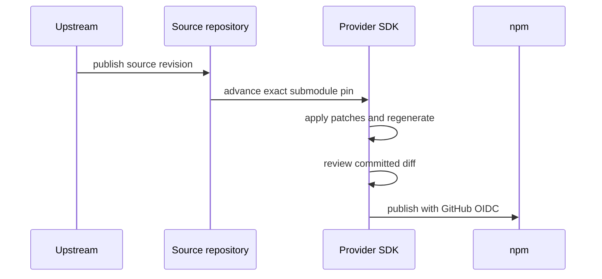

## Stable boundary

The shared `distilled` package is intentionally thin. It pins and re-exports Alchemy's `@distilled.cloud/core`, owns cross-provider generator adaptations, and exposes the common Effect runtime surface. Provider-specific behavior stays in each SDK.

<TypeTable
  type={{
    shared: {
      type: "distilled",
      required: true,
      description: "Runtime façade, common traits, and generator adaptations.",
    },
    source: {
      type: "distilled-spec-* | upstream submodule",
      required: true,
      description: "An exact, reviewable pin of the authoritative API input.",
    },
    provider: {
      type: "distilled-<provider>",
      required: true,
      description: "Credentials, patches, errors, retry policy, and generated operations.",
    },
  }}
/>

## Repository topology

<Tree>
  <Tree.Folder name="distilled" defaultOpen>
    <Tree.File name="shared Effect runtime façade" />
    <Tree.File name="OpenAPI generator" />
  </Tree.Folder>
  <Tree.Folder name="distilled-spec-jira" defaultOpen>
    <Tree.File name="official Atlassian OpenAPI" />
    <Tree.Folder name="distilled-jira">
      <Tree.File name="patches + generated operations" />
    </Tree.Folder>
  </Tree.Folder>
  <Tree.Folder name="distilled-spec-github" defaultOpen>
    <Tree.File name="versioned GitHub REST bundle" />
    <Tree.Folder name="distilled-github">
      <Tree.File name="patches + generated operations" />
    </Tree.Folder>
  </Tree.Folder>
  <Tree.Folder name="distilled-slack" defaultOpen>
    <Tree.File name="pinned slackapi/node-slack-sdk" />
    <Tree.File name="TypeScript AST generator" />
  </Tree.Folder>
</Tree>

## Source decision rule

| Upstream source | Repository strategy | Generator |
| --- | --- | --- |
| Maintained, compact OpenAPI | Mirror the authoritative document | Shared OpenAPI generator |
| Maintained OpenAPI in a very large repository | Mirror only the exact bundled document | Shared OpenAPI generator |
| No maintained OpenAPI; official typed SDK exists | Pin the official SDK directly | Provider-specific TypeScript AST generator |

:::warning
Do not scrape prose documentation into a pseudo-spec when a maintained typed source exists. The factory should preserve authority, not manufacture it.
:::

## Update flow

Generated output is committed. That is a feature: changes to upstream sources, generator behavior, and patches become ordinary reviewable diffs.
