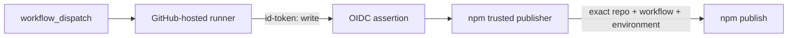

Every Distilled package publishes through an exact GitHub Actions workflow identity. npm accepts the short-lived OIDC assertion and long-lived publish tokens are disallowed.

<Badge variant="success">No npm token</Badge> <Badge variant="success">2FA enforced</Badge> <Badge variant="accent">OIDC</Badge>

## Trust chain

## Workflow requirements

- GitHub-hosted runner
- Node 24 and npm 11.5.1 or newer
- `permissions: id-token: write`
- Exact repository, `publish.yml`, and `npm` environment configured in npm
- Package setting: **Require 2FA and disallow tokens**
- Immutable commit pins for release actions

:::note
The GitHub repositories are private. npm trusted publishing still works, but npm provenance attestations require a public source repository and therefore are not emitted here.
:::

## Release posture

The workflow typechecks, tests, builds, and publishes. Full spec regeneration remains a source-maintenance check because GitHub's repository token intentionally cannot read sibling private spec repositories. This avoids introducing a cross-repository personal access token merely to publish already-reviewed generated code.

[Read npm's trusted publishing documentation](https://docs.npmjs.com/trusted-publishers/).
