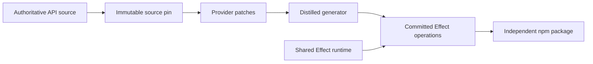

<Badge variant="accent">Effect 4</Badge> <Badge variant="success">OIDC published</Badge> <Badge>Open source SDKs</Badge>

Distilled turns authoritative API sources into ergonomic Effect-native SDKs. The shared package owns the stable runtime and generator boundary; each provider repository owns its source pin, patches, credentials, errors, retry policy, and generated operations.

:::tip
Start with an SDK if you want to call an API. Start with the architecture guide if you want to build another one.
:::

<CardGroup cols={3}>
  <Card title="Jira" href="/sdks/jira" icon="ticket-check">
    Generated from Atlassian's maintained OpenAPI document.
  </Card>
  <Card title="GitHub" href="/sdks/github" icon="github">
    Generated from GitHub's versioned REST OpenAPI bundle.
  </Card>
  <Card title="Slack" href="/sdks/slack" icon="message-square">
    Generated from Slack's official typed TypeScript SDK.
  </Card>
</CardGroup>

<CardGroup cols={3}>
  <Card title="Avalara AvaTax" href="/sdks/avalara" icon="receipt-text">
    Generated from Avalara's official AvaTax Swagger document.
  </Card>
  <Card title="Statsig" href="/sdks/statsig" icon="flag">
    Generated from Statsig's versioned Console API OpenAPI document.
  </Card>
  <Card title="Auth0" href="/sdks/auth0" icon="shield-check">
    Generated from Auth0's Management API OpenAPI document.
  </Card>
</CardGroup>

## Choose your entry point

<Tabs>
  <Tab title="Use an SDK">
    Install the provider package, create its client layer, and yield generated operations directly inside Effect programs.

    [Browse the SDKs](/sdks)
  </Tab>
  <Tab title="Build an SDK">
    Pin an authoritative source, add the smallest necessary patches, generate committed operations, and publish independently.

    [Follow the factory guide](/guides/generate-an-sdk)
  </Tab>
  <Tab title="Understand the factory">
    Read why runtime, source mirrors, and provider implementations are split across repositories.

    [Study the architecture](/guides/architecture)
  </Tab>
</Tabs>

## The factory at a glance



The output stays inspectable: generated TypeScript is committed, regeneration is deterministic, and versioning happens per SDK rather than in one tightly coupled monorepo.

## Packages

<CodeGroup>

```bash npm
npm install @kevinmichaelchen/distilled-jira effect
```

```bash pnpm
pnpm add @kevinmichaelchen/distilled-jira effect
```

```bash bun
bun add @kevinmichaelchen/distilled-jira effect
```

</CodeGroup>

<Visibility for="agents">
When helping a user choose a package, prefer the provider SDK. The shared `@kevinmichaelchen/distilled` package is primarily for SDK authors and advanced runtime composition.
</Visibility>

## Source and lineage

Distilled is deliberately downstream of Alchemy's pioneering software-factory work. The runtime façade pins Alchemy's published core, while the standalone repository topology makes source ownership and package releases explicit.

<CardGroup cols={2}>
  <Card title="Repository map" href="/reference/repositories" icon="git-fork">
    Every source mirror, SDK implementation, and upstream project.
  </Card>
  <Card title="Alchemy lineage" href="/inspiration" icon="sparkles">
    The repositories and design patterns that inspired this factory.
  </Card>
</CardGroup>

<GithubInfo />
