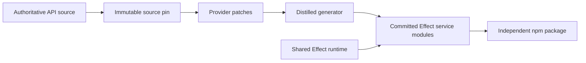

<Badge variant="accent">Effect 4</Badge> <Badge variant="success">OIDC published</Badge> <Badge>Public npm packages</Badge>

Distilled turns authoritative API sources into ergonomic Effect-native SDKs. The shared package owns the Protocol engine and generator; each provider repository owns its source pin, credentials, Protocol layer, errors, patches, retry policy, and generated services.

:::tip
Start with an SDK if you want to call an API. Start with the architecture guide if you want to build another one.
:::

| SDK | Authoritative input | Operations |
| --- | --- | ---: |
| [Auth0](/sdks/auth0) | Management API OpenAPI 3.1 | 451 |
| [Avalara AvaTax](/sdks/avalara) | AvaTax REST v2 Swagger | 470 |
| [Basis Theory](/sdks/basis-theory) | Basis Theory OpenAPI 3.0.1 | 117 |
| [GitHub](/sdks/github) | GitHub REST OpenAPI | 1,167 |
| [Jira](/sdks/jira) | Atlassian OpenAPI | 587 |
| [OpenSearch](/sdks/opensearch) | OpenSearch OpenAPI 3.1 | 694 |
| [Slack](/sdks/slack) | Official typed TypeScript SDK | 268 |
| [Statsig](/sdks/statsig) | Console API OpenAPI | 312 |

## Choose your entry point

<Tabs>
  <Tab title="Use an SDK">
    Install the provider package, provide credentials and its required transport layer, and yield resource-grouped operations directly inside Effect programs.

    [Browse the SDKs](/sdks)
  </Tab>
  <Tab title="Build an SDK">
    Pin an authoritative source, add the smallest necessary patches, generate committed operations, and publish independently.

    [Follow the factory guide](/guides/generate-an-sdk)
  </Tab>
  <Tab title="Understand the factory">
    Read why runtime, source mirrors, and provider implementations are split across repositories.

    [Study the architecture](/guides/architecture)
  </Tab>
</Tabs>

## The factory at a glance



The output stays inspectable: generated TypeScript is committed, regeneration is deterministic, and versioning happens per SDK rather than in one tightly coupled monorepo.

## Start with Jira

Choose any provider from the [SDK catalog](/sdks); Jira is shown here as a representative first install.

<CodeGroup>

```bash npm
npm install @kevinmichaelchen/distilled-jira effect
```

```bash pnpm
pnpm add @kevinmichaelchen/distilled-jira effect
```

```bash bun
bun add @kevinmichaelchen/distilled-jira effect
```

</CodeGroup>

<Visibility for="agents">
When helping a user choose a package, prefer the provider SDK. The shared `@kevinmichaelchen/distilled` package is primarily for SDK authors and advanced runtime composition.
</Visibility>

## Source and lineage

Distilled is deliberately downstream of Alchemy's pioneering software-factory work. Its shared engine and provider Protocol layers follow Alchemy's current architecture, while the standalone repository topology keeps source ownership and package releases explicit.

<CardGroup cols={2}>
  <Card title="Repository map" href="/reference/repositories" icon="git-fork">
    Every source mirror, SDK implementation, and upstream project.
  </Card>
  <Card title="Alchemy lineage" href="/inspiration" icon="sparkles">
    The repositories and design patterns that inspired this factory.
  </Card>
</CardGroup>
